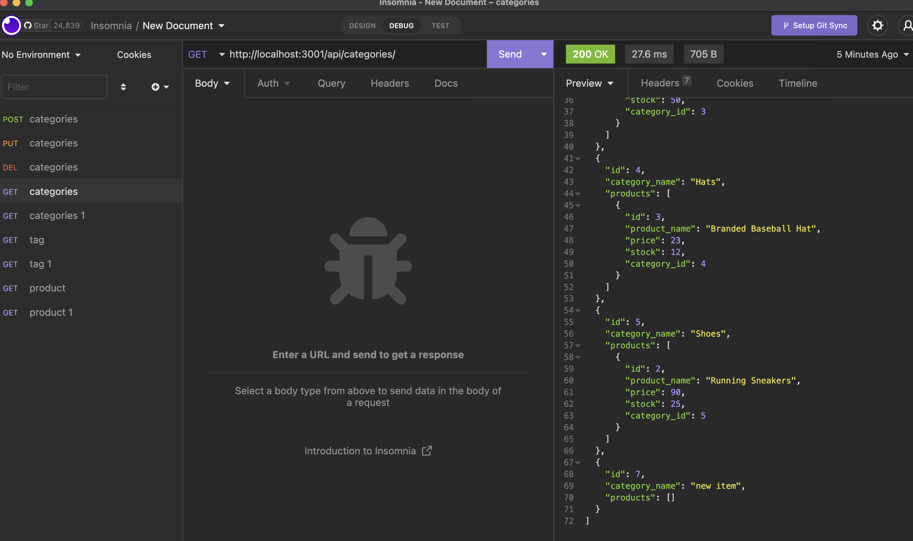

# Ecommerce Back End

## Description

This is a ecommerce back end file. As a manager you will be able to manage all your inventories and products.

## Installation

Node.js 
NPM install 
Mysql install run schema 
npm run seed 
npm start 
Insomnia

## Link

https://drive.google.com/file/d/1J_Uew0ySAdkwZ2QtpTtDHxWlBzYimaG7/view
 

## Usage

In the command-line user will run Mysql in the db folder. Source schema.sql in the mysql application. Then in the new terminal run node server.js or npm start in the Ecommerce folder. Then start the Insomnia app and run the routes.

## Credits

Kevin

## License

Please refer to the LICENSE in the repo.